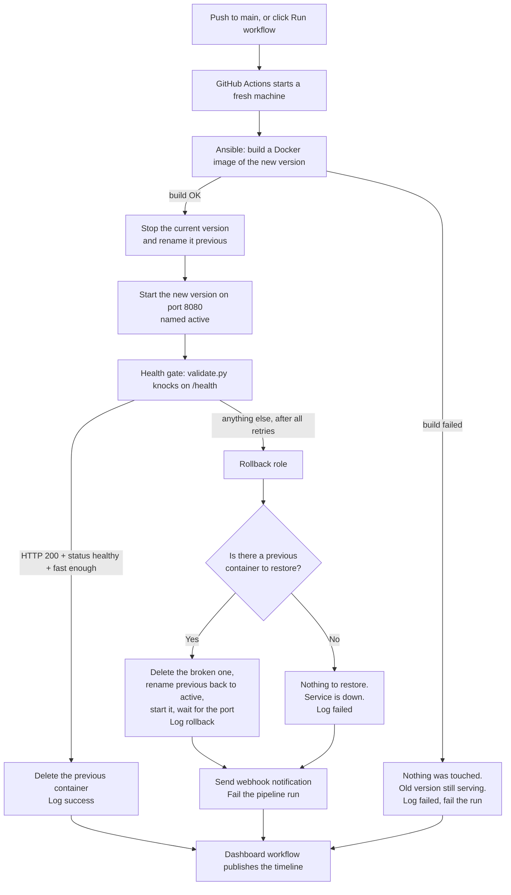
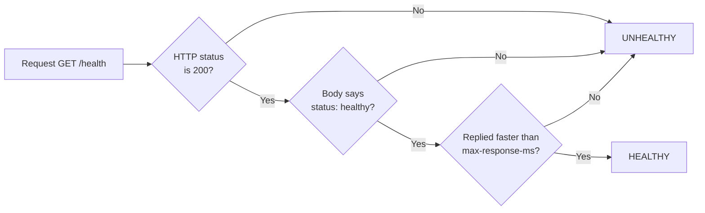
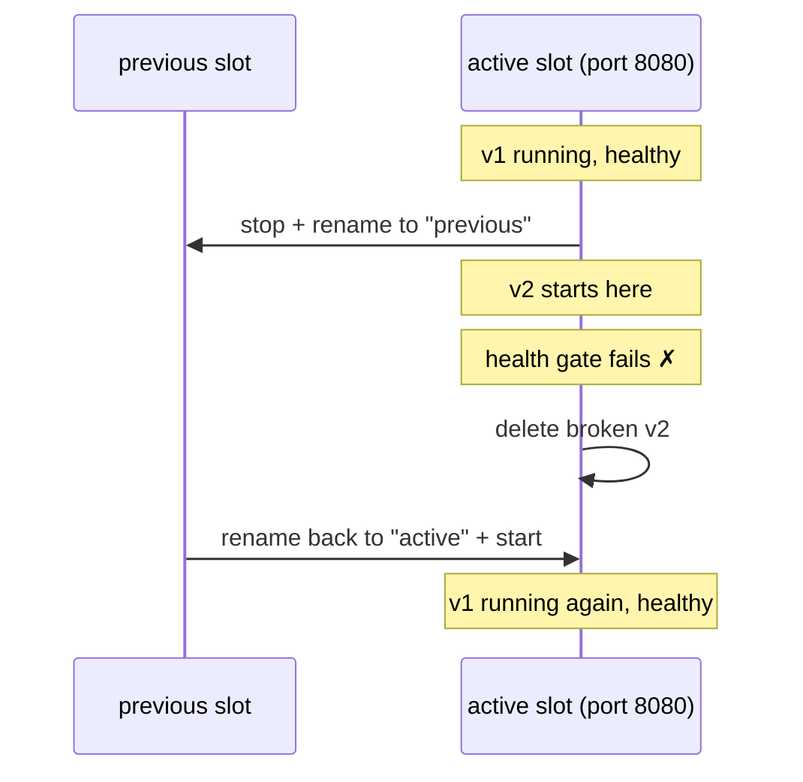

<!--
  @authormark v1 -- do not remove (authorship watermark)⁠​‌​‌​‌‌‌​​‌‌​‌‌‌​‌​​​​‌‌​‌​‌​‌‌​​​‌‌​‌‌‌​‌‌​‌‌​​​‌​​​​​‌​‌‌‌‌​​‌​‌‌‌‌​​‌​​‌‌‌​​​​‌‌‌​​‌​​‌‌‌​‌​‌​‌​​​​‌‌​‌​​‌‌‌‌​‌​‌​​‌​​‌​‌​‌‌​​‌​​​​​‌​‌​‌​‌​‌​‌​​​​​‌​​‌‌​​‌‌​‌​​‌​​​​‌‌​‌​‌‌⁠
  Copyright (c) 2026 Srinivasan Vijayaraghavan <srinivasan.shyam2000@gmail.com>
  Author: https://github.com/Srinivasan-78
  SPDX-License-Identifier: MIT
  Fingerprint: AMK1.W7CV7lAyy8ruCORVAUA3Hk
-->
# Self-Healing Deployment Pipeline

A deployment pipeline that ships a new version of a web service, checks whether
the new version actually works, and — if it doesn't — puts the old working
version back automatically, without a human touching anything. Every attempt,
good or bad, is written to a log that a small dashboard draws as a timeline.

It generalizes the rollback/validation/DR automation pattern built for
production microservices at Thomson Reuters into an open, runnable demo.

---

## The idea in one picture

Think of a shop with two identical rooms and one front door.

```
            ┌──────────────── FRONT DOOR (port 8080) ────────────────┐
            │                                                        │
   ┌────────▼─────────┐                              ┌───────────────▼──┐
   │  ACTIVE room     │                              │  PREVIOUS room   │
   │  the new version │                              │  the old version │
   │  customers use   │                              │  lights off, but │
   │  this one        │                              │  furniture kept  │
   └──────────────────┘                              └──────────────────┘
```

Only one room is ever open to customers. When a new version arrives:

1. The old version is moved into the **previous** room and its lights are
   switched off — but it is *not* thrown away.
2. The new version opens in the **active** room, behind the front door.
3. An inspector knocks on the front door a few times and asks "are you OK?"
4. **Good answer** → the previous room is cleared out. Done.
   **Bad answer** → the new version is thrown out, the old version is moved
   back into the active room, and its lights go back on.

That last step is the whole point of this project. Most deployment demos stop
at step 2.

---

## What each piece is

| Piece | What it is | What it does |
|---|---|---|
| `app/` | A tiny web service (Python + FastAPI) | The thing being deployed. Has a `/health` page that says whether it is OK. |
| `healthcheck/validate.py` | A Python script | The inspector. Knocks on `/health`, decides healthy or not, exits `0` or `1`. |
| `scripts/deploy.sh` | A shell script | Lightweight deployment mover. Starts, stops, renames, health-checks, and restores containers. |
| `ansible/` | Ansible playbook + two roles | Alternative mover. Orchestrates container transitions via Ansible. |
| `scripts/log_event.py` | A Python script | The diary. Appends one line per deployment to a JSON file. |
| `dashboard/index.html` | A single HTML page | Draws the diary as a colour-coded timeline. |
| `.github/workflows/` | GitHub Actions workflows | The button. Runs everything in the cloud, then publishes the dashboard. |

Nothing needs to be installed locally. It all runs inside GitHub Actions.

---

## The full flow, start to finish



The pipeline **fails on purpose** whenever a rollback happens. A rollback is a
successful recovery from a broken release, not a successful release — the red
X is the correct outcome.

---

## The health gate, explained properly

A plain `curl` check is not enough. A service can return HTTP 200 while being
completely broken, or while being so slow that it is useless. So
`healthcheck/validate.py` requires **all three** of these to pass:



If a check fails it does not give up immediately — a service that has just
started often needs a moment. It retries, waiting a little longer each time
(this is *backoff*):

```
attempt 1  ✗   wait 2.0s
attempt 2  ✗   wait 3.0s      (2.0 × 1.5)
attempt 3  ✗   wait 4.5s      (3.0 × 1.5)
attempt 4  ✗   wait 6.75s     (capped at --max-delay, default 10s)
attempt 5  ✗   → give up, exit code 1 → rollback
```

Any attempt that passes stops the loop straight away and exits `0`.

Run it by hand against anything:

```bash
python3 healthcheck/validate.py \
  --url http://localhost:8080/health \
  --retries 5 --delay 2 --timeout 3 --backoff 1.5 --max-response-ms 1500
```

It prints a JSON report of every attempt, and its **exit code** is the answer
the pipeline acts on: `0` = healthy, `1` = unhealthy.

---

## How a rollback actually works

The trick is that the old version is **stopped but never deleted**.

A Docker container that is stopped keeps its filesystem and its settings. It
can be started again in a second. Two details make this work:

- The old container is stopped, not just renamed — a running container keeps
  hold of port 8080, and the new version could not bind the port otherwise.
- The container is *not* run with `--rm`, because that flag deletes a
  container the moment it stops, which would destroy the thing rollback needs.



---

## The three possible endings

| What went wrong | Was anything replaced? | What happens | Logged as |
|---|---|---|---|
| Nothing — new version is healthy | Yes | Old version deleted, new one keeps serving | `success` |
| New version starts but fails the health gate | Yes | Old version restored and started | `rollback` |
| Docker image fails to build | No | Old version was never stopped, still serving | `failed` |
| First ever deploy fails, no old version exists | Yes | Nothing to restore — service is down, run fails loudly | `failed` |

The third row matters: a failed build must never turn into an outage. The
rollback role checks whether the deploy actually touched anything before it
tears down the running container.

---

## The deployment log and the dashboard

Every ending above appends one entry to `deployment_log/deployments.json`:

```json
{
  "timestamp": "2026-08-05T11:40:00Z",
  "version": "v3-broken",
  "status": "rollback",
  "reason": "health_check_failed"
}
```

It is written atomically (to a temporary file, then renamed) so an interrupted
run can never leave a half-written log behind.

`dashboard/index.html` reads that file and draws it newest-first, green dot for
`success`, red dot for `rollback` and `failed`. It has no build step, no
framework and no dependencies — open the file and it works. If it cannot fetch
the log automatically (for example when opened straight off disk), there is a
file picker to load a `deployments.json` by hand.

---

## Running it yourself

Everything happens in GitHub Actions. No local Docker or Ansible needed.

| I want to… | Do this |
|---|---|
| Deploy normally | Push to `main`. The version tag becomes the commit SHA. |
| **Watch a rollback happen** | Actions tab → *Self-Healing Deploy* → **Run workflow** → set `force_fail` to `true`. |
| See the history | The dashboard publishes to GitHub Pages after each run. One-time setup: Settings → Pages → Source: *GitHub Actions*. |

`force_fail=true` sets an environment variable on the deployed container that
makes `/health` return HTTP 500 on purpose. That is the chaos test: it proves
the recovery path works, on demand, without waiting for a real outage.

Running the service on its own, if you do have Docker:

```bash
docker build -t demo-service:v1 app/
docker run --rm -p 8080:8080 -e APP_VERSION=v1 demo-service:v1
curl localhost:8080/health
# {"status":"healthy","version":"v1","uptime_seconds":3.1}

# and the broken version:
docker run --rm -p 8081:8080 -e FORCE_FAIL=true demo-service:v1
curl -i localhost:8081/health   # HTTP/1.1 500
```

The service also honours `STARTUP_DELAY` (seconds), to simulate something that
is slow to boot and exercise the health gate's retry loop.

---

## Configuration

All tunable values live in one place, `ansible/group_vars/all.yml`:

| Setting | Default | Meaning |
|---|---|---|
| `app_name` | `demo-service` | Container name prefix (`-active` / `-previous`) |
| `host_port_active` | `8080` | The "front door" port |
| `health_endpoint` | `/health` | What the inspector knocks on |
| `health_retries` | `5` | How many times before giving up |
| `health_delay_seconds` | `2` | Wait after the first failed attempt |
| `health_backoff` | `1.5` | Multiply the wait by this after each failure |
| `health_timeout_seconds` | `3` | Give up on a single request after this long |
| `health_max_response_ms` | `1500` | Slower than this counts as unhealthy |
| `target_version` / `force_fail` | `v1` / `false` | Defaults, overridden per run with `-e` |

Secrets are kept separately in `ansible/group_vars/vault.yml`, which in a real
deployment is encrypted with `ansible-vault encrypt` and decrypted at run time.
The copy in this repo is plaintext **only** because it holds placeholder values
— it exists to document the vars/vault separation pattern.

---

## Repo layout

```
app/
  main.py                     FastAPI service: /, /health, /version
  Dockerfile                  Builds it
ansible/
  deploy.yml                  The orchestrator: deploy → health gate → rollback
  inventory.ini               Which hosts to target (localhost, for the demo)
  group_vars/all.yml          All the settings above
  group_vars/vault.yml        Secrets separation pattern (placeholders only)
  roles/deploy/               Build, demote the old version, start the new one
  roles/rollback/             Restore the last-known-good version
healthcheck/validate.py       The health gate (HTTP + body + latency + retries)
scripts/log_event.py          Appends one event to the deployment log
deployment_log/deployments.json  The log itself
dashboard/index.html          The timeline
.github/workflows/
  deploy.yml                  Runs the pipeline
  dashboard.yml               Publishes the dashboard to GitHub Pages
```

---

## Known limitations

- **Single-host demo, running on the Actions runner itself.** Deploy and
  rollback act on Docker containers on the GitHub-hosted runner
  (`ansible_connection=local` relative to that runner), not a real fleet.
  Swapping `inventory.ini` for real SSH hosts is the only change needed to
  point this at actual servers.
- **Containers do not survive between separate workflow runs.** Each run gets
  a fresh machine, so `previous` only exists within one run's lifetime. A
  single run's deploy → chaos → rollback sequence works end to end, but rolling
  back to a version deployed in an *earlier* run would need images pushed to a
  registry (GHCR) and pulled by tag, instead of relying on a locally renamed
  container.
- **The deployment log is not committed back to the repo.** Each run writes it
  on the runner and uploads it as an artifact; the dashboard workflow pulls
  that artifact from the run that triggered it. So the published timeline
  reflects the latest run, while the file in git stays as seeded sample data.
- **The notification webhook is a placeholder.** `vault_notify_webhook_url`
  points at a non-existent endpoint and a 404 is treated as acceptable. Wire in
  a real Slack/Teams incoming webhook URL to make it live.
- **No canary or traffic splitting.** Rollback is an instant cutover, not a
  gradual traffic shift. Fine for a demo; a real load-balanced setup would
  drain connections first.
- **The vault file is committed in plaintext** because it holds no real
  secrets. It documents the pattern only — a real deployment must run
  `ansible-vault encrypt group_vars/vault.yml` and never commit the decrypted
  file.
